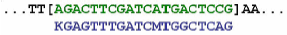
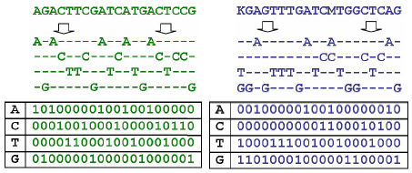
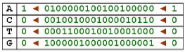
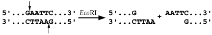
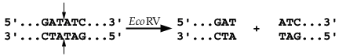
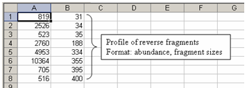

# Synopsis
MiCA was designed as a web-based tools for the analysis of microbial community based on restriction fragment
length polymorphisms (T-RFLP). MiCA was developed by students and faculty of the [Initiative for Bioinformatics
and Evolutionary Studies (IBEST)](https://www.ibest.uidaho.edu/) at the University of Idaho. This project was
funded by the [Procter & Gamble Company](https://us.pg.com/). MiCA provides analysis tools to perform tasks; (1)
*in silico* PCR amplification and restriction of 16S rRNA gene sequences, and (2) comparison of multiple T-RFLP
profiles obtained from a single sample using different primer-enzyme combinations.

# Usage and Example
Analysis of T-RFLP data requires a large number of parameters such as forward and reverse primers, restriction
enzymes, database and search sensitivity. To simplify the task, a parameter file was introduced. The parameter file
lists all the parameters require to run each analysis. The example lists the steps to compile the analysis tools
and how to run these tools from the command-line. It is import to note that these tools were originally designed
with a web-interface. The web-interface validates the parameters and user data, and then compiles the parameter
file. The code that actually runs the analysis does not check for any error or inconsistency in the parameters or
user data. Therefore, for a successful analysis, it is important to make sure that all parameters and user data are
properly formatted. The analysis tools generally do not report any errors even if it has occurred.

## Compile the Source Code
It is import to note that the analysis tools run in parallel and require the
[`phread` library](https://en.wikipedia.org/wiki/POSIX_Threads). To compile the C++ source code, first change to
the source code folder and then type the command:

`make`

You should see the messages:

```
g++ -O3 -I. bitvector.cpp cmdparam.cpp seqdb.cpp erpa.cpp -o erpa -lpthread
g++ -O3 -I. bitvector.cpp cmdparam.cpp seqdb.cpp ispar.cpp -o ispar -lpthread
g++ -O3 -I. bitvector.cpp cmdparam.cpp seqdb.cpp pat.cpp -o pat -lpthread
g++ -O3 -I. bitvector.cpp cmdparam.cpp seqdb.cpp pspa.cpp -o pspa -lpthread
g++ -O3 -I. bitvector.cpp cmdparam.cpp seqdb.cpp trflp.cpp -o trflp -lpthread
```

The `make` command will compile the C++ source code and generate the executables for APLAUS+ (`trflp`), ISPaR
(`ispa`), PSPA (`pspa`), and ERPA (`erpa`). For the analysis of T-RFLP, the executable `trflp` is needed. The C++
source code has been tested on the Windows and Ubuntu platforms. You should not encounter any issues. To remove
all existing executables, type the command:

`make clean`

## Prepare the Database
The database must be formatted before it can be used for analysis. The format was designed to simplify the analysis
process with only essential information such as strain name and accession number, about the sequences. To prepare
the SILVA database, for example, first download the sequence file, `SILVA_138_SSUParc_tax_silva.fasta.gz`, at the
[SILVA repository](https://www.arb-silva.de/no_cache/download/archive/release_138/Exports/), and then run the PHP
script:

```
fas2txt.php SILVA_138_SSUParc_tax_silva.fasta SILVA_138_SSUParc_tax_silva.txt
```

The script requires two arguments, the input database and output file. The script should not take more than a few
minutes to complete even for a large database. Once the database has been converted successfully, you should
update the database in the parameter file to reflect the change.

## Parameter File
The parameter file lists all the necessary parameters to run the analysis successfully.

```
filename = output
database = bacteria.txt
forward = ACKGCTCAGTAACACGT
forward = GCTCAGTAACACGTGG
forward = CGGACGGGTGAGTAACGCGTGA
reverse = TCCCCTAGCTTTCGTCCC
reverse = GGGTTGCGCTCGTTG
reverse = CGGTGTGTACAAGGCCCGGGAACG
enzyme = CG^CG
enzyme = ^GATC
enzyme = CG^CG
max_base = 10
mismatch = 5
output_all = 1
sort_option = 0
forward_sample = forward.csv
reverse_sample = reverse.csv
forward_shift = 1
reverse_shift = 2
```

- `filename`: output filename without an extension. The analysis will output in the CSV and text format.
- `database`: name of the database
- `forward`: forward primer sequence. The analysis supports up to three forward primers.
- `reverse`: reverse primer sequence. The analysis supports up to three reverse primers.
- `enzyme`: restriction enzyme. The analysis supports up to three restriction enzymes.
- `max_base`: maximum number of bases that permit mismatches
- `mismatch`: maximum number of mismatches permitted
- `output_all`: `0`, output only the shortest fragments, or `1` all
- `sort_option`: `0`, sort by forward fragments in ascending order; `1`, sort by reverse fragments in ascending
order; `2`, sort by shortest forward fragments in ascending order, `3`, sort by shortest reverse fragments in
ascending order; `4`, sort by organism names in ascending order; `5`, sort by forward fragments in descending
order; `6`, sort by reverse fragments in descending order; `7`, sort by shortest forward fragments in descending
order; `8`, sort by shortest fragments in descending order; `9`, sort by organism names in descending order
- `forward_sample`: CSV file that contains the forward fragment lengths from experiments
- `reverse_sample`: CSV file that contains the reverse fragment lengths from experiments
- `forward_shift`: forward fragment matching threshold (+/- bps)
- `reverse_shift`: reverse fragment matching threshold (+/- bps)

## T-RFLP Analysis (APLAUS+)
APLAUS+ requires the parameters `filename`, `database`, `forward`, `reverse`, `enzyme`, `max_base`, `mismatch`,
`sort_order`, `forward_sample`, `reverse_sample`, `forward_shift`, and `reverse_shift` to run. To run APLAUS+,
type the command:

```
trflp example.txt
```

APLAUS+ performs *in silico* PCR, and infers the plausible community profile simultaneously. The construction of
community composition begins immediately after a successful *in silico* PCR on a template sequence. The predicted
fragments are compared to the data obtained using T-RFLP technique. Organisms are considered as a potential member
in the community only when both fragments (forward and reverse) match the T-RFLP data. Users can customize the
matching threshold for forward and reverse fragments to increase or decrease the coverage and sensitivity. After
the construction of plausible community composition, the algorithm proceeds to calculate the normalized relative
abundance for each member in the community. The calculation of relative abundance are based on the frequencies that
given fragments have been matched in the community. APLAUS+ currently only handles one T-RFLP profile generated
from one pair of fluorescently labeled primers and one restriction enzyme. Multiple T-RFLP profiles must be merged
manually.

## ISPaR (Virtual Digest)
ISPaR requires the parameters `filename`, `database`, `forward` (one only), `reverse` (one only), `enzyme` (up to
three), `max_base`, `mismatch`, `output_all`, and `sort_option` to run. To run ISPaR, type the command:

```
ispar example.txt
```

ISPaR perform *in silico* digest and requires one forward and one reverse primers, and at least one restriction
enzyme. ISPaR first identifies the primer binding sites on the template sequences. If the binding sites can be
found, then it proceeds to perform the restriction digests with given enzymes. The lengths of the forward and
reverse terminal fragments are then calculated and recorded. ISPaR reports the predicted forward and reverse
fragment lengths, sequence accession number, and the names of the organisms.

## Primer Sequence Prevalence Analysis (PSPA)
PSPA requires the parameters `filename`, `database`, `forward` (up to three), `reverse` (up to three),
`max_base`, `mismatch`, and `sort_option` to run. To run PSPA, type the command:

```
pspa example.txt
```

PSPA utilizes a simplified version of *in silico* amplification algorithm that does not search for the restriction
recognition sites. Instead, it only calculates the lengths of the amplicons delimited by the primer pairs. The
algorithm only keeps track of the number of successful amplifications, and the lengths of the amplicons are not
recorded. It is important to note that the number of successful amplifications on a given forward primer will not
always be the same if it is paired with a different reverse primer. This phenomenon is largely due to the nature
of the search algorithm and locations of the primer binding sites. It is assumed that primer binding sites must be
sufficiently distant in order to maintain biological relevance. The runtime of PSPA grows exponential because all
possible permutation of forward and reverse primers will be used for the analysis.

## Enzyme Resolving Power Analysis (ERPA)
PSPA requires the parameters `filename`, `database`, `forward` (one only), `reverse` (one only), `enzyme`
(unlimited), `max_base`, `mismatch`, and `sort_option` to run. To run ERPA, type the command:

```
erpa example.txt
```

ERPA utilizes a simplified version of *in silico* amplification algorithm that only permits one pair of forward
and reverse primers. The algorithm first identifies the primer binding sites on the template sequence. Restriction
digest are performed only when amplifications succeed. The algorithm then perform the digest with all the
restriction enzymes specified in the parameter file. ERPA reports the number of unique forward and reverse
restriction fragments digested for each enzyme. Several descriptive statistics such as means and standard
deviations are reported. Detailed fragment lengths, however, are not reported.

# Design of MiCA
The development of MiCA aimed to provide a suite of high-performance, computational tools for the studies of
microbial based on Terminal restriction fragment length polymorphism (T-RFLP). T-RFLP is one of several molecular
methods aimed to generate a fingerprint of an unknown microbial community. It is a molecular biology technique for
profiling of microbial communities based on the position of a restriction site closest to a labelled end of an
amplified gene. The method is based on digesting a mixture of PCR amplified variants of a single gene using one
or more restriction enzymes and detecting the size of each of the individual resulting terminal fragments using
a DNA sequencer. T-RFLP utilizes properties of the sequences of the gene being amplified as a proxy for actual
sequence information, and provides a community profile (or fingerprint) that reflects the composition of the
numerically dominant populations in a sample. It takes advantage of restriction site polymorphisms in PCR amplified
rRNA genes to produce fluorescently labeled terminal fragments that differ in length. These are then resolved by
either using acrylamide gel electrophoresis or by capillary electrophoresis. DNA fragments that differ in size
correspond to phylogenetically distinct populations in the community. Information about specific groups of
organisms can be obtained by using group-specific PCR primers. T-RFLP data can be interpreted using a database of
known sequences since differences in the sizes of the fragments produced are presumably solely the result of
difference in the primary sequences of rRNA genes.

## The Algorithm
Unlike traditional character-based approaches, the binary-encoding scheme utilizes four parallel bit streams to
represent the nucleic acid characters. This approach exploits the fact that there are only four possible bases
(adenine (`A`), cytosine (`C`), guanine (`G`), and thymine (`T`)). Each bit stream reflects the existence of such
a nucleotide in the sequence. The bit pattern of `1` signals the existence of such a nucleotide at a given position
while `0` signals its absence. Since nucleotides are individually represented, any possible ambiguities in the
sequence can be fully encoded and resolved. Consequently, instead of comparing each nucleotide explicitly, the
entire process is reduced into a series of binary operations on each bit stream. Once the bit patterns of integers
are compared using the binary `AND` operator, the resulting matrices are added with a binary `OR` operator. At this
stage, the names of the nucleotides are no longer relevant because only the number of matches in a given
subsequence is of interest. In addition, the binary `OR` operator reduces the resulting matrix into a single binary
representation of the nucleic matches found at all positions in the subsequence. In addition, the binary encoding
scheme also makes the calculation of complementary bases trivial. The calculation only requires swapping the order
of the representing bit streams for the nucleic acids. The following figure shows a hypothetical forward primer and
short section of template sequences to illustrate how the transformation and search are performed.



**Figure 1**: The sequence on the top is a hypothetical DNA template and bottom is a forward primer
(`5'-KGAGTTTGATCMTGGCTCAG-3'`). The subsequence in brackets is the region that the sarch algorithm is currently
examining. The template and primer sequences will be transformed into binary-coded streams before the search
proceeds.

The transformation procedures first split up each DNA sequence into four parallel subsequences. Each subsequence
then represents a particular nucleic acid and encodes the locations where such a nucleotide can be found in the
sequence. Since each nucleotide is individually represented, any ambiguities can be fully resolved and
represented. The subsequences are then further simplified to a series of bit streams, and each bit pattern encodes
the relative locations and occurrences of a nucleotide in the sequence.



**Figure 2**: The transformation procedures first split up the sequence into four subsequences based on the
nucleic acids. Each subsequence encodes the locations where such a nucleotide can be found. This approach enables
ambiguities to be fully resolved and represented. For example, the ambiguity code, `K` (at the very beginning of
the primer), is a redundant position that encodes both thymine (`T`) and guanine (`G`), and `M` (at the 12th
position in the primer) is a second redundant position that encodes both adenine (`A`) and cytosine (`C`). The
subsequences are then further simplified to a series of bit streams.

The search begins with a binary `AND` operation on the bit streams that represent the same nucleotide; that is,
the bit streams that represent adenine, for example, for the template sequence will be compared with the bit
streams that represent the same nucleotide for the primer sequence. The binary encoding scheme simplifies the
search by reducing the complex character-to-character comparisons into a series of single step binary operations.
The resulting bit streams indicate where a given nucleotide can be found on both the template and primer
sequences. The following shows the binary `AND` operations that match corresponding bit patterns.


**Figure 3**: The binary `AND` operator identifies positions where a given nucleotide can be found on both the
template (top row) and primer (second row) sequences. The binary encoding scheme reduces the conventional complex
character-to-character comparisons into a series of simple binary operations.

After the bit patterns that represent individual nucleotides are compared, a binary OR operator then summarizes
all resulting bit streams. At this stage, the names of the nucleotides are no longer relevant because only the
number of matches in a given subsequence is of interest. In addition, the binary OR operator reduces the resulting
matrix into a single binary representation of the nucleic matches found at all positions in the subsequence.


**Figure 4**: The binary `OR` operator summarizes the bit streams that encode the locations where given
nucleotides can be found on the template and primer sequences. The names of nucleotides are no longer relevant
because only the number of matches is of interest.

To advance the search along the template sequence, the entire matrix is shifted to the left by one bit. This
approach is very efficient because all previous bit patterns are still preserved by the representation, and it is
not necessary to repeat the transformation process for the remainder of sequence. An analogous process is used to
identify restriction enzyme recognition sites. Once the primer and restriction enzyme sites have been located, the
length of the intervening DNA (in base pairs) can be calculated and reported.



**Figure 5**: The next nucleotide is added to the rightmost positions of the bit streams, and the search advances
to the next nucleotide. This example shows that an adenine is being added to the first bit streams, with the
left-most base (in this example an `A`) being removed from the stream. All previous bit patterns are still
preserved by the representation.

## Restriction Sites Search
A restriction enzyme cleaves double-stranded DNA at all sites in the molecule where the base sequence matches a
particular short nucleotide sequence called the restriction site of the enzyme. In naming restriction enzymes, the
first three letters are italicized because they abbreviate the organism in which the enzyme was first discovered,
for example, the *Eco* in *Eco*RI stands for *Escherichia coli*. These special enzymes recognize specific
sequences in DNA molecules, and themselves display palindromic sequences. Restriction enzymes are typically of
four, five, or six nucleotides in length. They function as microbial immune systems that protect bacteria from
infection by viruses. The presence of additional enzymes generally shows a multiplicative effect; a cell with
multiple independent restriction enzymes could be virtually impregnable. The strict nucleotide sequence
specificity dictates the utilization of restriction enzymes. In evolutionary studies, for example, restriction
sites are commonly used to determine if DNA sequences vary between isolates. The cut made by restriction enzymes
is usually staggered such that the two strands of the double helix are cut a few bases apart. This creates
single-stranded overhangs called sticky ends at either end of the digested DNA molecule. The overhangs are said to
be sticky because they are able to bind to a complementary single-stranded region. The figure shows that the
restriction enzyme, *Eco*RI (`5'-GAATTC-3'`), leaves sticky ends at both ends of a sequence.



**Figure 6**: The restriction enzyme, *Eco*RI, causes breaks in the backbone of the DNA sequence and leaves a
staggered cut because it results in fragments with single-stranded ends. The single-stranded ends are said to be
sticky because they are able to bind to a complementary single-stranded region.

Some restriction enzymes are also capable of producing fragments without single-stranded overhangs. This commonly
refers to as a blunt cut. As opposed to sticky cutters, no complementarities are required. The following figure
shows an example of a blunt cut. The figure illustrates a blunt cut made by the restriction enzyme *Eco*RV
(`5'-GATATC-3'`).



**Figure 7**: The restriction enzyme, *Eco*RV (`5'-GATATC-3'`) produces fragments without single-stranded
overhangs. This commonly refers to as a blunt cut. As opposed to sticky cutters, no complementarities are
required.

## Flat File Database
The design of the sequence database utilizes the flat file format. Specifically, MiCA uses the database uses the
format that the data fields are separated by a vertical bar `|`, `strain|accession number|species|sequence`. A
flat file is quick and easy, and takes less space than a relational database. MiCA originally utilized an Oracle
database server. The server itself required a massive amount of computing power and memory. This required MiCA to
run on a relatively high-end server computer. The flat file format reduces the requirement for computing power and
memory. This design, however, only permits sequential retrievals. Random access to different sequences in the
database is not possible. There are also no structural relationships between sequences in the database. It is
import to keep the format consistent in order to avoid data corruptions. Any updates on the sequences require
reconstruction of the entire database.

## ISPaR (Virtual Digest)
The development of ISPaR (*in silico* PCR and Restriction) aims to provide a computational tool that explores and
simulates experiments with all possible recognition sites using a database containing large numbers of sequences.
It features a fast search algorithm that can accommodate primers with multiple redundant positions is needed. The
search algorithm accurately predicts the terminal restriction fragments with given primers and enzymes. ISPaR
performs *in silico* amplification and restriction of 16S and 18S rRNA sequences. The query page lists all
available primers and restriction enzymes in dropdown menus. The location and number of allowed mismatches between
primers and target sequences are then stipulated to modulate the breadth and sensitivity of the search. ISPaR
utilizes the binary encoding scheme for the primer sequences. The algorithm first delimits or double-digests the
template sequence by the forward and reverse primers. Once the primer binding sites are located, ISPaR then
searches for the restriction sites with the same binary encoding scheme. ISPaR permits up to three restriction
enzymes. The most significant feature of the search algorithm is the permission of mismatches within the primer
sequences. Ambiguities on restriction enzymes are also supported. To increase the search sensitivity, restriction
enzymes can contain any number of degenerate bases. This feature closely mimics the actual biological processes of
sequence amplifications. Consequently, ISPaR can indeed deliver unprecedented accuracy and performance for
simulations of restriction digests. It is important to note that the elevated number of degenerate bases in the
template sequences and restriction enzymes promotes the probability of false positive matches. Therefore, it is
crucial to ensure the sequence data maintains the highest fidelity and accuracy.

## APLAUS+ (T-RFLP Analysis)
APLAUS+ utilizes the CSV (Comma Separated Values) format. The CSV file format is often used to exchange data
between disparate applications. The file format, as it is used in Microsoft Excel, has become a widely accepted
standard in the industry. A CSV file is a specially formatted plain text file, which stores spreadsheet or basic
database-style information in a very simple format, with one record on each line, and each field within that
record separated by a comma. CSV files are often used as a simple way to transfer a large volume of spreadsheet or
database information between programs, without concerning about special file types. The following figure show how
to create a CSV formatted sample file for APLAUS+.



The APLAUS+ algorithm compares the data from one ore more T-RFLP profiles to the outcomes(s) of *in silico*
analyses of sequences in the database done using the same primers and restriction enzymes. The outcome is one or
more plausible community structures, one(s) that in theory would produce the T-RLFP profiles that have been
observed. For a particular combination of enzymes and primers two or more phylotypes might theoretically produce
exactly the same size fragments and cannot be distinguished. In these instances, APLAUS+ combines the phylotypes
into a single group.

## PSPA (Primer Sequence Prevalence Analysis)
The development of PSPA (primer sequence prevalence analysis) aims to meet the challenge of effective primer
selection and provide high-throughput *in silico* analysis of primer combinations. PSPA utilizes a simplified
version of ISPaR search algorithm, which only identifies the forward and reverse primer binding sites. It will
accept as many as three forward and three reverse primers. All possible combinations of given forward and reverse
primers will be used for the analysis, and the same parameter settings for mismatches will be applied uniformly
to each combination. For example, if two forward and three reverse primers were chosen, then a total of six
possible combinations will be used for the analysis. The analysis of primer sequence prevalence is considerably
more computationally intensive. AS an example, an analysis of three forward and three reverse primers can take
as long as 25sec. PSPA reports the number of successful amplifications for each primer individually (forward and
reverse) and for each primer pair collectively. It is worth noting that the number of successful amplifications on
a given forward primer will not always be the same if it is paired with different reverse primers. This phenomenon
is largely due to the nature of the search algorithm and locations of primer binding sites. It is assumed that
primer binding sites must be sufficiently distant in order to maintain biological relevance.

## ERPA (Enzyme Resolving Power Analysis)
ERPA (enzyme resolving power analysis) provides a high performance analytical tool for the selection and analysis
of restriction enzymes. It requires a pair of forward and reverse primers in order to produce the amplicons, and
then the search algorithm iterates through the entire lest of restriction enzymes available in MiCA. The search
algorithm is the same as that of ISPaR. ERPA reports the number of unique forward and reverse restriction
fragments digested with each enzyme. Several descriptive statistics, such as means and standard deviations, are
also reported. Ideally, with a properly chosen pair of forward and reverse primers, the restriction enzyme that
gives the maximum number of unique fragments is able to better resolve phylogenetically distinct species.
Molecular markers are generally considered constant landmarks in the genome, and are found at specific locations
of the sequences. There are many molecular techniques that rely on the restriction fragment polymorphism for the
identification of species. Restriction fragment length polymorphism (RFLP), for example, is based on detection of
variations in restriction fragment length of specific DNA sections among individual, as determined by the presence
or absence of restriction sites. It is then possible to locate a gene by looking for RFLP that are almost always
inherited with it. As another example, random amplification of polymorphic DNA (RAPD) are DNA fragments, which are
polymorphic in size, generated by PCR using one or two randomly selected primers. They are dominant markers and
RAPD patterns can be used in strain identification (one of the methods of DNA fingerprinting). In AFLP, DNA
treated with restriction enzymes is amplified using PCR. The method allows selective amplification of restriction
fragments, giving rise to large amount of useful markers that can be located on the genome relatively quickly and
reliably.

## Source Code
This table lists the description of the source code in MiCA. It is import to note that the code `bitvector.cpp`,
`cmdparam.cpp`, and `seqdb.cpp` are required for all the analysis tools.

| Filename | Descriptions |
| --- | --- |
| `Makefile` | makefile for the source code |
| `READMe.md` | this file |
| `bitvector.cpp` | implementation of the binary encoding scheme |
| `bitvector.h` | header file for the binary encoding scheme |
| `cmdparam.cpp` | command line parameter parser |
| `cmdparam.h` | header file for the command line parameter parser |
| `erpa.cpp` | enzyme resolving power analysis program |
| `erpa.h` | header file for the enzyme resolving power analysis |
| `ispar.cpp` | *in silico* polymerase chain reaction program |
| `ispar.h` | header file for the *in silico* polymerase chain reaction |
| `pat.cpp` | phylogenetic analysis using only one labeled fragments |
| `pat.h` | header file for the phylogenetic analysis program |
| `pspa.cpp` | primer sequence prevalence analysis program |
| `pspa.h` | header file for the primer sequence analysis |
| `seqdb.cpp` | database interface program |
| `seqdb.h` | header file for the database interface |
| `trflp.cpp` | terminal restriction fragment length polymorphism program |
| `trflp.h` | header for the terminal restriction fragment length polymorphism program |

# Author's comments
MiCA was developed in 2004 and has not beed updated for a while. Although the technology used in MiCA is a bit
outdated. However, the code has been relatively robust. If you have any suggests or comments, please
[email me](mailto:shyu4751@yahoo.com). If you use MiCA for your analysis, please consider citing the following
publication.

C. Shyu, T. Soule, S.J. Bent, J.A. Foster, L.J. Forney, L.J. (2007) MiCA: A Web-Based Tool for the Analysis of
Microbial Communities Based on Terminal-Restriction Fragment Length Polymorphisms of 16S and 18S rRNA Genes.
*Journal of Microbial Ecology* 53:562-570.

# GNU Public License
This program is free software: you can redistribute it and/or modify it under the terms of the GNU General Public
License as published by the Free Software Foundation, either version 3 of the License, or (at your option) any
later version.

This program is distributed in the hope that it will be useful, but WITHOUT ANY WARRANTY; without even the implied
warranty of MERCHANTABILITY or FITNESS FOR A PARTICULAR PURPOSE. See the GNU General Public License for more
details. You should have received a copy of the [GNU General Public License](http://www.gnu.org/licenses/) along
with this program.
